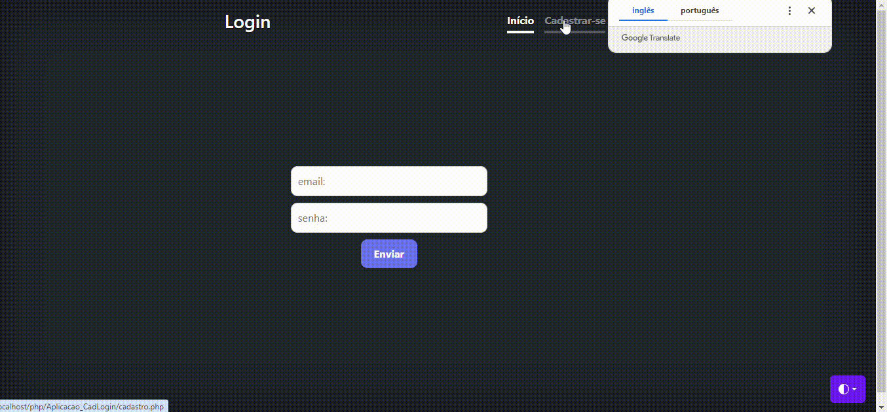

# índice
[APLICACAO_CADLOGIN](#aplicacao_cadlogin)  
[Descrição](#descrição)  
[Funcionalidades](#funcionalidades)  
[Tecnologia utilizada](#tecnologia-utilizadas)  
[Fontes consultadas](#fontes-consultadas)  
[Autores](#autores)

# Aplicação_CadLogin

## Descrição 📝
Este projeto é uma aplicação web de cadastro e login, desenvolvida para demonstrar a implementação.

## Funcionalidades⚙️
- Cadastro de novos usuários
- Login de usuários registrados
- Validação de entrada do usuário
- Armazenamento seguro de senhas 
- Mensagens de erro claras para falhas de autenticação

## Finalidade.
A finalidade de um de aplicação de cadastro de login é múltipla e fundamental para a segurança e gerenciamento de usuários em sistemas web

### Tecnologia utilizada ⌨️
* `html`
* `github`
* `bootstrap`
* `style`

## Fontes consultadas 🔍
* bootrtrap

## Autores ✍️
[Julia] https://github.com/juliaburque/Aplicacao_CadLogin

